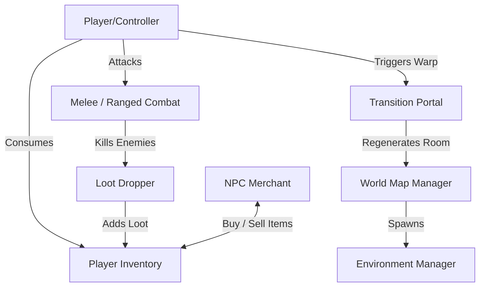

# เอกสารสรุปโครงสร้างโปรเจกต์ (Project Overview & Systems Guide)

เอกสารฉบับนี้จัดทำขึ้นเพื่อสรุปภาพรวมระบบการทำงานทั้งหมดของโปรเจกต์ **"The Last Empire"** เพื่อให้ผู้พัฒนาใหม่ ทีมงาน หรือผู้ที่เข้ามาอ่านสามารถทำความเข้าใจโครงสร้าง สถาปัตยกรรม วิธีการทำงานของโค้ดแต่ละส่วน และแนวทางการพัฒนาต่อยอดได้อย่างสะดวกรวดเร็ว

---

## 📂 1. ภาพรวมของเกม (Core Gameplay Loop)
**The Last Empire** เป็นเกมแนว Action Survival มุมมองแบบ Top-Down 3D 
*   **การสำรวจ (Exploration):** ผู้เล่นจะเดินทางสลับห้องผ่านประตูพอร์ทัล 4 ทิศทาง (เหนือ, ใต้, ออก, ตก) บนแผนที่กริดที่เกิดจากการสุ่มสร้างแบบไดนามิก
*   **การเอาชีวิตรอด (Survival):** ตัวละครผู้เล่นมีความหิว (Hunger) ที่ลดลงเรื่อยๆ ตามเวลา (การวิ่งเร็วจะลดหิวคูณสอง) ต้องกินขนมปังเพื่อประทังชีวิต และมีค่าพลังชีวิต (Health) ที่ต้องฟื้นฟูด้วยน้ำยาโพชั่น
*   **การต่อสู้ (Combat):** ต่อสู้กับฝูงซอมบี้ด้วยอาวุธปืน (ยิงกระสุนจำกัดตามแมกกาซีน ต้องคอยรีโหลดกระสุนจากเป้) หรือใช้อาวุธระยะประชิดฟันสกัดผลักศัตรูให้กระเด็นชะงัก
*   **เศรษฐกิจ (Economy):** กำจัดซอมบี้เพื่อเก็บเงิน ฟาร์มไอเทม หรือเอาของเหลือใช้ไปขายให้ NPC พ่อค้าที่ราคากลาง 30% แล้วนำเงินไปซื้อปืน, กระสุน หรือโพชั่นเพื่อเตรียมพร้อมลุยห้องต่อไป

---

## 🛠️ 2. ระบบหลักในปัจจุบันและการทำงาน (Core Systems & Mechanics)

### **2.1 ระบบควบคุมตัวละครและการเอาชีวิตรอด (Player Controller & Survival)**
*   **ไฟล์หลัก:** [PlayerController.cs](file:///d:/Unity%20Game%20Project/Eruption/TheLastEmpire/TheLastEmpire/Assets/Scripts/Runtime/Player/PlayerController.cs), [PlayerInventory.cs](file:///d:/Unity%20Game%20Project/Eruption/TheLastEmpire/TheLastEmpire/Assets/Scripts/Runtime/Player/PlayerInventory.cs), [Health.cs](file:///d:/Unity%20Game%20Project/Eruption/TheLastEmpire/TheLastEmpire/Assets/Scripts/Runtime/Combat/Health.cs)
*   **การเคลื่อนไหว:** รองรับทิศทาง WASD / จอยคอนโทรลเลอร์
*   **การวิ่งเร็ว (Sprinting):** กด `Shift` ค้าง เพิ่มความเร็ว 1.5 เท่า แต่แลกมาด้วยอัตราความหิวลดฮวบคูณ 2
*   **การแดชหลบหลีก (Dashing):** กด `Spacebar` พุ่งตัวหลบหลีก พร้อมสถานะอมตะชั่วขณะ (I-Frames)
*   **ความหิวและพลังชีวิต (Hunger & Health):** พลังชีวิตห้ามเหลือ 0 ความหิวที่ลดลงจนสุดจะค่อยๆ ลดค่าพลังชีวิตลงแทน ฟื้นฟูด้วยไอเทมจำพวกโพชั่นและขนมปัง

### **2.2 ระบบแผนที่และการสลับฉาก (Procedural Map & Portal Transition)**
*   **ไฟล์หลัก:** [WorldMapManager.cs](file:///d:/Unity%20Game%20Project/Eruption/TheLastEmpire/TheLastEmpire/Assets/Scripts/Runtime/Map/WorldMapManager.cs), [TransitionPortal.cs](file:///d:/Unity%20Game%20Project/Eruption/TheLastEmpire/TheLastEmpire/Assets/Scripts/Runtime/Map/TransitionPortal.cs)
*   **ตารางห้องแผนที่ (Grid Map):** โลกถูกแบ่งเป็นตารางขนาด $n \times n$ ทุกครั้งที่วาร์ปเข้าด่านใหม่ ข้อมูลห้องและสิ่งกีดขวางจะถูกสร้างขึ้นด้วย Stage Seed สำหรับด่านนั้นๆ เสมอ
*   **สลักประตูทางเชื่อม (Portal Shifting):** ประตูพอร์ทัลจะสลับตำแหน่งสุ่มแกนรองตาม Seed เสมอ เพื่อลดความจำเจในการเดิน
*   **ความปลอดภัยในการเปิดเส้นทาง (Portal Visibility):** ประตูจะปิดและซ่อนตัวเองลงอัตโนมัติ (ปิด MeshRenderer/Collider) หากด้านข้างไม่มีห้องข้างเคียงอยู่จริง ป้องกันตัวละครเดินตกฉาก
*   **แอนิเมชั่นเปลี่ยนผ่าน (DOTween Transition):** ตอนผู้เล่นแตะพอร์ทัล ฉากจะถูกบดบังด้วยภาพสีดำ (Fade In) -> สลับฉากเทเลพอร์ตผู้เล่น -> ค้างหน้าจอดำไว้ 0.5 วินาที -> ภาพค่อยๆ จางออก (Fade Out) และสั่งปิดการทำงานตัววาร์ป เพื่อความนุ่มนวลของสายตา

### **2.3 ระบบการต่อสู้ (Combat System)**
*   **อาวุธปืน (Ranged Combat):** 
    *   ต้องมีกระสุนปืนตรงรุ่นอยู่ในกระเป๋าเป้ เมื่อกดรีโหลด (`R`) ระบบจะหักกระสุนจากเป้มาใส่ในแมกกาซีน
    *   กระสุนถูกยิงออกจากกระป๋องเก็บพูลวัตถุ (Object Pool) เพื่อประหยัดทรัพยากร
    *   ความยาวกระสุนคำนวณสัมพันธ์กับ `Attack Radius` (ระยะเมตรของปืน) หารด้วยความเร็วกระสุนจริง
*   **อาวุธระยะประชิด (Melee Combat):**
    *   ตัวละครมีมีดติดตัวตอนเริ่ม สามารถเก็บอาวุธอื่น เช่น ไม้เบสบอล หรือมาเชเต้มาสวมใส่ทดแทนได้
    *   การฟันจะสร้างขอบเขตกลม (OverlapSphere) ด้านหน้า ตรวจจับศัตรูทั้งหมดที่อยู่ในรัศมี ทำการสร้างดาเมจ ผลักกระเด็น (Knockback) และชะงัก (Stagger) ตามสถิติอาวุธ
*   **สูตรดาเมจโจมตี:**
    $$\text{ดาเมจสุทธิ} = \text{ดาเมจพื้นฐานของตัวละคร (10)} + \text{โบนัสดาเมจของอาวุธนั้น ๆ}$$

### **2.4 ระบบคลังและร้านค้าซื้อ-ขาย (Inventory & Shop UI)**
*   **ไฟล์หลัก:** [ShopUI.cs](file:///d:/Unity%20Game%20Project/Eruption/TheLastEmpire/TheLastEmpire/Assets/Scripts/Runtime/UI/ShopUI.cs), [InventoryUI.cs](file:///d:/Unity%20Game%20Project/Eruption/TheLastEmpire/TheLastEmpire/Assets/Scripts/Runtime/UI/InventoryUI.cs)
*   **สไตล์หน้าจอ:** ใช้ Slick Dark Mode กึ่งกระจกเบลอ (Glassmorphism) สวยงามสะดุดตา
*   **คลังกระเป๋าเป้ (Inventory):** กดเปิดด้วยปุ่ม `I` หรือ `ESC` ตัวเกมจะหยุดเวลาทันที (`Time.timeScale = 0`) แสดงไอเทมที่ซ้อนทับกัน, ดาเมจอาวุธ, และปุ่มกดกิน/ใช้งานได้ทันที
*   **แท็บซื้อและขาย (Buy & Sell Tabs):** 
    *   **BUY:** แสดงไอเทมที่พ่อค้ามีขายโดยใช้ราคาเริ่มต้นจากไฟล์กลาง `ShopDatabase`
    *   **SELL:** ดึงไอเทมในกระเป๋าเป้ผู้เล่นมาแสดงผลเพื่อแลกเปลี่ยนเป็นเงินสดในอัตราราคากลาง **30%** (ปุ่มขายของติดตัวที่สวมใส่อยู่จะขึ้นสีล็อกเตือน ห้ามกดขาย)
    *   **โหมดสว่างตรวจสอบฟรี (Is Free):** ตั้งค่าที่ NPC ตัวนั้นๆ ราคาสินค้าจะเป็น `$0` ทันทีเพื่อความสะดวกรวดเร็วในการเทสเกม

### **2.5 ระบบควบคุมไอเทมดรอป (Loot Table System)**
*   **ไฟล์หลัก:** [LootDropper.cs](file:///d:/Unity%20Game%20Project/Eruption/TheLastEmpire/TheLastEmpire/Assets/Scripts/Runtime/Combat/LootDropper.cs)
*   **การตั้งค่าอิสระ (Custom Loot Table):** สามารถกดแอดรายการดรอปใน Inspector ของซอมบี้แต่ละพรีแฟบได้อย่างอิสระ:
    *   ระบุชื่อไอเทมดรอป (เช่น Potion, Bread, Pistol Ammo, หรือคีย์เวิร์ดพิเศษ `"Money"` สำหรับสุ่มเงินสด)
    *   ระบุจำนวนต่ำสุด-สูงสุด
    *   ระบุเปอร์เซ็นต์โอกาสดรอป (`0.0` ถึง `1.0` หรือ 0%-100%)
*   **กลไกการสุ่ม:** ใช้หลักการหมุนค่าความน่าจะเป็นอิสระทุกชิ้น ทำให้การตาย 1 ครั้งของซอมบี้สามารถมีไอเทมดรอปตกลงมามากกว่า 1 ชิ้นพร้อมกันได้

---

## 🧠 3. สถาปัตยกรรมทางโค้ดที่สำคัญ (Technical Highlights)
1.  **การล้างหน่วยความจำเมื่อ Retry (Clean Scene Reloading):**
    *   เมื่อโหลดด่านใหม่ผ่านการ Retry `ObjectPoolManager` จะดักจับอีเวนต์ `sceneLoaded` ทำการกวาดทำลาย (Destroy) วัตถุศัตรู/กระสุนเดิมที่ยังค้างอยู่ในฉากจากรอบการเล่นที่แล้วทั้งหมด และสร้างพูลออฟเจกต์เริ่มต้นใหม่ทันที เพื่อเลี่ยงบั๊ก AI เป้าหมายเสีย
2.  **การดึงข้อมูลฐานข้อมูลแบบยืดหยุ่น (Recursive Resources Load):**
    *   ใช้เมธอด `Resources.LoadAll<T>("")` เพื่อทำดัชนีและดักจับไอเทมทั้งหมดที่อยู่นอกลิสต์ดาต้าเบส หรืออยู่ในโฟลเดอร์ลึกๆ อัตโนมัติ ทำให้ผู้พัฒนาปรับเปลี่ยนโครงสร้างโฟลเดอร์ได้โดยไม่เกิดปัญหา Code Break

---

## 📝 4. แผนงานพัฒนาต่อยอดในอนาคต (Planned Features Roadmap)
*   **ระบบค่าสถานะตัวละคร (Player Stats System):** เพิ่มค่าประสบการณ์ เลเวลอัพตัวละคร และนำแต้มไปอัพเกรดสเตตัสหลัก (เช่น ความอึด, ดาเมจพื้นฐาน, ความเร็วในการหลบหลีก)
*   **ระบบปรับปรุงคุณภาพอาวุธ (Weapon Upgrades):** ตู้คอนเทนเนอร์อัพเกรดปืนเพื่อเพิ่มพลังดาเมจและลดระยะเวลารีโหลดกระสุน
*   **เพิ่มประเภทสิ่งกีดขวางและกับดัก (Hazards & Trap Barriers):** บล็อกหนาม, ท่อนซุงแกว่ง หรือหลุมพิษที่สร้างดาเมจแบบ Real-time ให้ผู้เล่นในด่าน
*   **เพิ่มประเภทของปืนใหม่ (New Weapon Classes):** อาวุธไฟพ่น (Flame Thrower) หรืออาวุธระเบิดวงกว้าง (Rocket Launcher)
*   **บอสอารีน่า (Boss Arenas):** ปิดทางออกของพอร์ทัลบังคับเผชิญหน้ากับซอมบี้ระดับบอสยักษ์ก่อนเคลียร์ Biome เพื่อสลับไปสู่ Biome ระดับความยากถัดไป

---

## 📁 5. โครงสร้าง Scripts ทั้งหมด (Scripts Directory Reference)

Scripts ทั้งหมดอยู่ภายใต้ `Assets/Scripts/Runtime/` แบ่งออกเป็น 7 โฟลเดอร์หลัก รวม **43 ไฟล์**

### 👤 `Player/` — ระบบตัวละครผู้เล่น

| Script | หน้าที่ |
|---|---|
| [PlayerController.cs](file:///d:/Unity%20Game%20Project/Eruption/TheLastEmpire/TheLastEmpire/Assets/Scripts/Runtime/Player/PlayerController.cs) | **หัวใจหลัก** — ควบคุมการเคลื่อนที่, ยิงปืน, ฟันระยะประชิด, แดช, ความหิว, รีโหลด |
| [PlayerInventory.cs](file:///d:/Unity%20Game%20Project/Eruption/TheLastEmpire/TheLastEmpire/Assets/Scripts/Runtime/Player/PlayerInventory.cs) | จัดการกระเป๋าเป้ — เพิ่ม/ลบไอเทม, กดใช้ไอเทม, นับเงิน |
| [PlayerHUD.cs](file:///d:/Unity%20Game%20Project/Eruption/TheLastEmpire/TheLastEmpire/Assets/Scripts/Runtime/Player/PlayerHUD.cs) | แสดง HP บาร์, ความหิว, จำนวนกระสุนบนหน้าจอ |
| [CameraFollow.cs](file:///d:/Unity%20Game%20Project/Eruption/TheLastEmpire/TheLastEmpire/Assets/Scripts/Runtime/Player/CameraFollow.cs) | กล้องติดตามตัวละครผู้เล่น |
| [CameraObstacleFader.cs](file:///d:/Unity%20Game%20Project/Eruption/TheLastEmpire/TheLastEmpire/Assets/Scripts/Runtime/Player/CameraObstacleFader.cs) | ทำให้สิ่งกีดขวางระหว่างกล้องกับผู้เล่นกลายเป็นโปร่งใส |
| [LootContainer.cs](file:///d:/Unity%20Game%20Project/Eruption/TheLastEmpire/TheLastEmpire/Assets/Scripts/Runtime/Player/LootContainer.cs) | จัดการกล่องสมบัติที่ผู้เล่นสามารถเปิดเก็บไอเทมได้ |

---

### ⚔️ `Combat/` — ระบบศัตรูและการต่อสู้

| Script | หน้าที่ |
|---|---|
| [BaseEnemyAI.cs](file:///d:/Unity%20Game%20Project/Eruption/TheLastEmpire/TheLastEmpire/Assets/Scripts/Runtime/Combat/BaseEnemyAI.cs) | **คลาสหลักของศัตรูทุกตัว** — ไล่ผู้เล่น, รับดาเมจ, Knockback, Stagger, OOB Rescue |
| [ZombieAI.cs](file:///d:/Unity%20Game%20Project/Eruption/TheLastEmpire/TheLastEmpire/Assets/Scripts/Runtime/Combat/ZombieAI.cs) | ซอมบี้ทั่วไป — extends BaseEnemyAI |
| [BanditAI.cs](file:///d:/Unity%20Game%20Project/Eruption/TheLastEmpire/TheLastEmpire/Assets/Scripts/Runtime/Combat/BanditAI.cs) | ศัตรูประเภท Bandit |
| [AlienAI.cs](file:///d:/Unity%20Game%20Project/Eruption/TheLastEmpire/TheLastEmpire/Assets/Scripts/Runtime/Combat/AlienAI.cs) | ศัตรูประเภท Alien |
| [BeastAI.cs](file:///d:/Unity%20Game%20Project/Eruption/TheLastEmpire/TheLastEmpire/Assets/Scripts/Runtime/Combat/BeastAI.cs) | ศัตรูประเภทสัตว์ร้าย |
| [RobotAI.cs](file:///d:/Unity%20Game%20Project/Eruption/TheLastEmpire/TheLastEmpire/Assets/Scripts/Runtime/Combat/RobotAI.cs) | ศัตรูประเภท Robot |
| [Health.cs](file:///d:/Unity%20Game%20Project/Eruption/TheLastEmpire/TheLastEmpire/Assets/Scripts/Runtime/Combat/Health.cs) | คอมโพเนนต์ HP ใช้ทั้งผู้เล่นและศัตรู — รับดาเมจ, ฟื้นฟู, I-Frame |
| [IDamageable.cs](file:///d:/Unity%20Game%20Project/Eruption/TheLastEmpire/TheLastEmpire/Assets/Scripts/Runtime/Combat/IDamageable.cs) | Interface บังคับให้มี `TakeDamage()` เป็นมาตรฐาน |
| [DamageDealer.cs](file:///d:/Unity%20Game%20Project/Eruption/TheLastEmpire/TheLastEmpire/Assets/Scripts/Runtime/Combat/DamageDealer.cs) | คอมโพเนนต์ Trigger ที่ดีลดาเมจเมื่อสัมผัส |
| [Projectile.cs](file:///d:/Unity%20Game%20Project/Eruption/TheLastEmpire/TheLastEmpire/Assets/Scripts/Runtime/Combat/Projectile.cs) | พฤติกรรมกระสุน — บินไปตรงๆ, ชน, คืนสู่ Pool |
| [ObjectPoolManager.cs](file:///d:/Unity%20Game%20Project/Eruption/TheLastEmpire/TheLastEmpire/Assets/Scripts/Runtime/Combat/ObjectPoolManager.cs) | ระบบ Pool กระสุน/ศัตรู ประหยัด RAM, เคลียร์เมื่อ Retry |
| [LootDropper.cs](file:///d:/Unity%20Game%20Project/Eruption/TheLastEmpire/TheLastEmpire/Assets/Scripts/Runtime/Combat/LootDropper.cs) | ดรอปไอเทมเมื่อศัตรูตาย ตาม Custom Loot Table |
| [CollectibleItem.cs](file:///d:/Unity%20Game%20Project/Eruption/TheLastEmpire/TheLastEmpire/Assets/Scripts/Runtime/Combat/CollectibleItem.cs) | พฤติกรรมของไอเทมที่ตกพื้น — รอเก็บ, แสงกระพริบ |
| [NPCController.cs](file:///d:/Unity%20Game%20Project/Eruption/TheLastEmpire/TheLastEmpire/Assets/Scripts/Runtime/Combat/NPCController.cs) | NPC พ่อค้า — เปิด ShopUI, รองรับ `Is Free` Test Mode |
| [EnemyHealthText.cs](file:///d:/Unity%20Game%20Project/Eruption/TheLastEmpire/TheLastEmpire/Assets/Scripts/Runtime/Combat/EnemyHealthText.cs) | ตัวเลข Pop-up บอก HP ที่หายเหนือหัวศัตรู |

---

### 🗺️ `Map/` — ระบบแผนที่และสลับฉาก

| Script | หน้าที่ |
|---|---|
| [WorldMapManager.cs](file:///d:/Unity%20Game%20Project/Eruption/TheLastEmpire/TheLastEmpire/Assets/Scripts/Runtime/Map/WorldMapManager.cs) | ตัวจัดการแผนที่กลาง — เก็บตำแหน่งปัจจุบัน X/Y |
| [WorldMapGenerator.cs](file:///d:/Unity%20Game%20Project/Eruption/TheLastEmpire/TheLastEmpire/Assets/Scripts/Runtime/Map/WorldMapGenerator.cs) | สุ่มสร้างข้อมูลห้อง/Biome บนกริดทั้งหมด |
| [WorldMapVisualizer.cs](file:///d:/Unity%20Game%20Project/Eruption/TheLastEmpire/TheLastEmpire/Assets/Scripts/Runtime/Map/WorldMapVisualizer.cs) | แสดงผลแผนที่ Mini-map บนหน้าจอ |
| [TransitionPortal.cs](file:///d:/Unity%20Game%20Project/Eruption/TheLastEmpire/TheLastEmpire/Assets/Scripts/Runtime/Map/TransitionPortal.cs) | ประตูวาร์ปสลับห้อง — Fade, เทเลพอร์ต, ซ่อนตัวถ้าไม่มีห้องข้างๆ |
| [StageData.cs](file:///d:/Unity%20Game%20Project/Eruption/TheLastEmpire/TheLastEmpire/Assets/Scripts/Runtime/Map/StageData.cs) | โครงสร้างข้อมูลของแต่ละห้อง (Seed, Biome, พิกัด) |
| [BiomeType.cs](file:///d:/Unity%20Game%20Project/Eruption/TheLastEmpire/TheLastEmpire/Assets/Scripts/Runtime/Map/BiomeType.cs) | Enum ประเภทไบโอม เช่น Desert, Forest, City |
| [LocalStageVisualizer.cs](file:///d:/Unity%20Game%20Project/Eruption/TheLastEmpire/TheLastEmpire/Assets/Scripts/Runtime/Map/LocalStageVisualizer.cs) | แสดงข้อมูลด่านปัจจุบัน (ชื่อ Biome, พิกัด) บนหน้าจอ |
| [GroundBiomeMaterialController.cs](file:///d:/Unity%20Game%20Project/Eruption/TheLastEmpire/TheLastEmpire/Assets/Scripts/Runtime/Map/GroundBiomeMaterialContro...) | สลับ Material พื้นดินตาม Biome ของห้องนั้น |

---

### 🏗️ `Managers/` — ระบบควบคุมกลาง

| Script | หน้าที่ |
|---|---|
| [GameManager.cs](file:///d:/Unity%20Game%20Project/Eruption/TheLastEmpire/TheLastEmpire/Assets/Scripts/Runtime/Managers/GameManager.cs) | Spawn ศัตรู, ควบคุม Game State (Playing/Dead/Retry), ป้องกัน Spawn ทับกัน |
| [EnvironmentManager.cs](file:///d:/Unity%20Game%20Project/Eruption/TheLastEmpire/TheLastEmpire/Assets/Scripts/Runtime/Managers/EnvironmentManager.cs) | สุ่มวาง Prop/อุปสรรคในห้อง ตาม Seed ป้องกัน Spawn ใกล้ประตู/ผู้เล่น |
| [DayNightManager.cs](file:///d:/Unity%20Game%20Project/Eruption/TheLastEmpire/TheLastEmpire/Assets/Scripts/Runtime/Managers/DayNightManager.cs) | วงรอบกลางวัน/กลางคืน ปรับแสงไฟ |

---

### 🗃️ `Data/` — ฐานข้อมูลไอเทม

| Script | หน้าที่ |
|---|---|
| [ItemData.cs](file:///d:/Unity%20Game%20Project/Eruption/TheLastEmpire/TheLastEmpire/Assets/Scripts/Runtime/Data/ItemData.cs) | ScriptableObject เก็บสถิติของไอเทมแต่ละชิ้น (ชื่อ, ราคา, ดาเมจ, ระยะ) |
| [ItemDatabase.cs](file:///d:/Unity%20Game%20Project/Eruption/TheLastEmpire/TheLastEmpire/Assets/Scripts/Runtime/Data/ItemDatabase.cs) | รวม ItemData ทุกชิ้น, เมธอด `GetItemByName()` ค้นหา Recursive ทุกโฟลเดอร์ |
| [ShopDatabase.cs](file:///d:/Unity%20Game%20Project/Eruption/TheLastEmpire/TheLastEmpire/Assets/Scripts/Runtime/Data/ShopDatabase.cs) | เก็บราคากลางของไอเทมทุกชิ้นสำหรับร้านค้า |

---

### 🖥️ `UI/` — ระบบหน้าจอ

| Script | หน้าที่ |
|---|---|
| [InventoryUI.cs](file:///d:/Unity%20Game%20Project/Eruption/TheLastEmpire/TheLastEmpire/Assets/Scripts/Runtime/UI/InventoryUI.cs) | หน้าต่างกระเป๋าเป้ (กด `I`) แสดงไอเทม, ปุ่มใช้/สวมใส่ |
| [ShopUI.cs](file:///d:/Unity%20Game%20Project/Eruption/TheLastEmpire/TheLastEmpire/Assets/Scripts/Runtime/UI/ShopUI.cs) | หน้าต่างร้านค้า แท็บ BUY/SELL |
| [LootUI.cs](file:///d:/Unity%20Game%20Project/Eruption/TheLastEmpire/TheLastEmpire/Assets/Scripts/Runtime/UI/LootUI.cs) | UI แสดงสิ่งของในกล่องสมบัติ |
| [MinimapUI.cs](file:///d:/Unity%20Game%20Project/Eruption/TheLastEmpire/TheLastEmpire/Assets/Scripts/Runtime/UI/MinimapUI.cs) | แสดง Mini-map มุมหน้าจอ |
| [HealthVisualizer.cs](file:///d:/Unity%20Game%20Project/Eruption/TheLastEmpire/TheLastEmpire/Assets/Scripts/Runtime/UI/HealthVisualizer.cs) | แถบ HP ลอยเหนือหัวศัตรู |
| [BillboardUI.cs](file:///d:/Unity%20Game%20Project/Eruption/TheLastEmpire/TheLastEmpire/Assets/Scripts/Runtime/UI/BillboardUI.cs) | ทำให้ UI 3D หันหน้าเข้าหากล้องเสมอ |

---

### 💾 `Save/` — ระบบบันทึกเกม

| Script | หน้าที่ |
|---|---|
| [SaveSystem.cs](file:///d:/Unity%20Game%20Project/Eruption/TheLastEmpire/TheLastEmpire/Assets/Scripts/Runtime/Save/SaveSystem.cs) | บันทึก/โหลดข้อมูลเกมลงดิสก์ |
| [SaveData.cs](file:///d:/Unity%20Game%20Project/Eruption/TheLastEmpire/TheLastEmpire/Assets/Scripts/Runtime/Save/SaveData.cs) | โครงสร้างข้อมูลที่ต้องการบันทึก (Serializable) |
